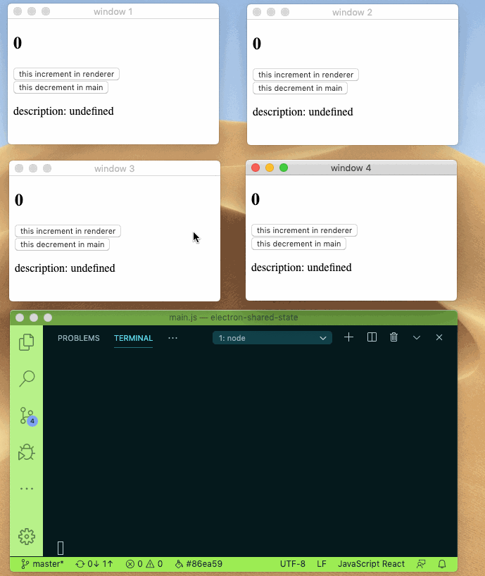

# electron-shared-state 

Sharing state between main and renderer process can be this easy.

- 🚀 Mutate your state while keep them in sync with other process!
- 🎯 Write in typescript with full typing support!
- ❤️ Elegant and easy to learn API!



## Install

```sh
npm install electron-shared-state
```

or

```sh
yarn add electron-shared-state
```

## Usage

```ts
// shared
export const initialState = 0;

// renderer
const sharedStore = createSharedStore(initialState);
sharedStore.subscribe(state => {
  console.log(state);
});

setTimeout(() => {
  sharedStore.setState(state => {
    state = state + 1;
  });
}, 2000);

// main
const sharedStore = createSharedStore(initialState);
sharedStore.subscribe(state => {
  console.log(state);
});

// both main and renderer will print the state after two seconds.
```

check source code under [example directory](/example) for more info.

## API Reference

```ts
function createSharedStore<T>(
  state: T
): {
  setState: (recipe: (draft: T) => void, description?: string | undefined) => T;
  getState: () => T;
  subscribe: (
    listener: (state: T, description?: string | undefined) => void
  ) => () => void;
};
```
